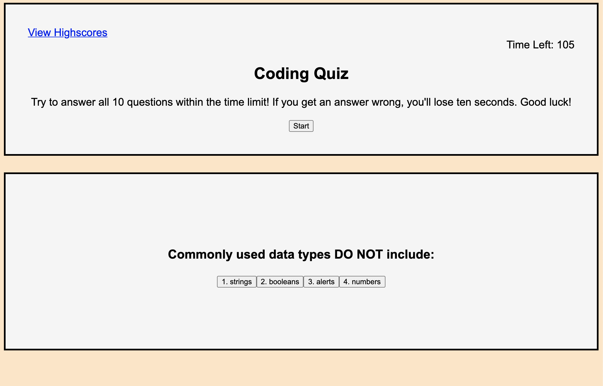

# Coding-Quiz-HW

I've created a Coding Quiz using HTML, CSS, and JavaScript. User has 2 minutes to complete 10 questions. If the user answers a question wrongly, 10 seconds are deducted from the timer. Users are given immediate feedback for questions answered.

This is the link to the deployed URL: (https://celestealexmoore.github.io/Week-4-Homework/)

This is my application:
